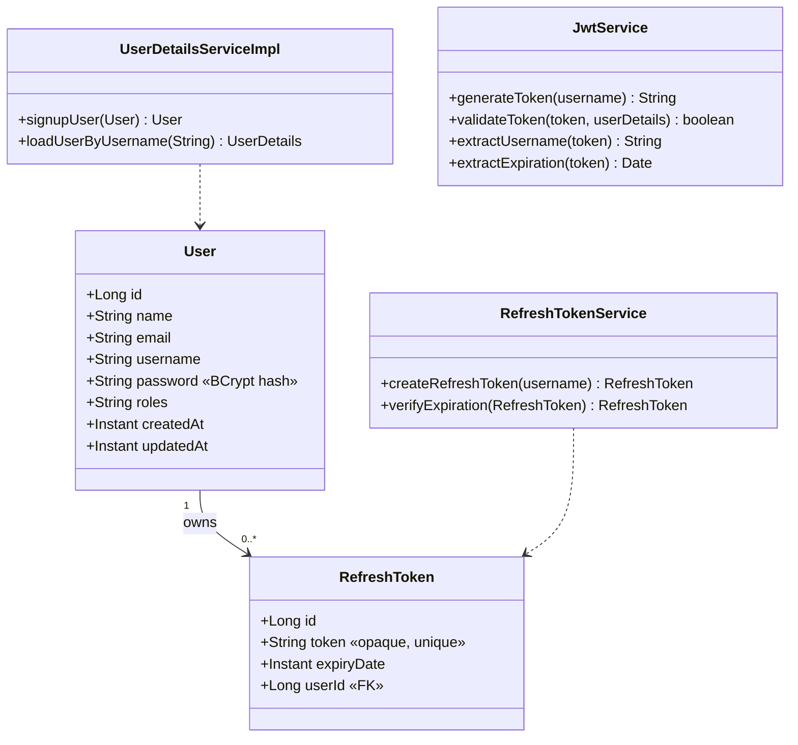
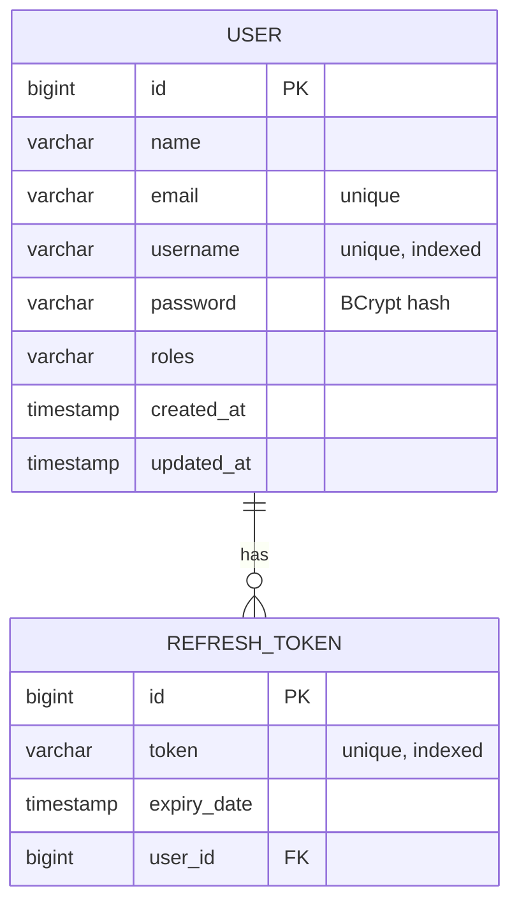

# Chapter 2 — Auth Service (EP01)

> **Scope:** Authentication & authorization for the Expense Tracker. The Auth
> Service authenticates and authorizes incoming requests from the
> **Templatisation service** and the **API Gateway**.

---

## 1. Problem statement

The Auth Service is the single source of truth for **who a caller is** (authentication)
and **what they're allowed to do** (authorization). Every request from the API Gateway
and Templatisation service is validated here before it reaches downstream services.

### Functional requirements

- Users can **sign up** and **log in**.
- Users are **not re-prompted to log in** on every app open (session persistence via tokens).
- Passwords are **stored encrypted** (hashed) in the database.
- **Access tokens** and **refresh tokens** are issued.
- Tokens travel only over **HTTPS**.
- The **event published to the User Service is recoverable and fault tolerant**.

### Non-functional requirements

- Authentication must be **fast** so app-open doesn't lag.
- The DB schema must avoid **complex, long-running queries (LRQ)**.

---

## 2. Whats & Hows of Tokens

### Why tokens at all?

HTTP is stateless — the server forgets you after each request. Without tokens the
user would have to send credentials on every call. A token is a **compact, signed,
time-bound proof of identity** the client presents instead of a password. It lets
authentication stay **stateless** (no server-side session lookup on the hot path),
which directly serves the "auth shouldn't lag app open" NFR.

### Access token (JWT)

- **What:** A short-lived JSON Web Token. Three parts — `header.payload.signature` —
  Base64URL-encoded and joined by dots.
- **Claims (payload):** `sub`/username, `iat` (issued at), `exp` (expiry), roles, etc.
- **How it's trusted:** signed with the server's secret (HMAC) or private key.
  Anyone holding the secret/public key can **verify** the signature without a DB call —
  this is what keeps validation fast and stateless.
- **Lifetime:** short (minutes). If stolen, the blast radius is small because it
  expires quickly.
- **Note:** JWT payload is *encoded, not encrypted* — never put secrets in it. Integrity,
  not confidentiality, is what the signature guarantees.

### Refresh token

- **What:** A long-lived, opaque token used only to obtain a **new access token**
  once the current one expires — without forcing the user to log in again. This is
  what satisfies "don't ask the user to log in every time."
- **How:** Stored in the DB (so it can be **revoked** and validated). When the access
  token expires, the client calls `/auth/v1/refreshToken`; the service validates the
  refresh token against the DB and mints a fresh access token.
- **Lifetime:** long (days/weeks). Because it's stateful (DB-backed), it can be
  invalidated on logout or compromise.

### The two-token dance

```
login ──► access token (short) + refresh token (long)
          │
          ├─ normal request:  send access token  ──► verify signature (no DB) ──► allow
          │
          └─ access expired:  send refresh token ──► /auth/v1/refreshToken ──► new access token
```

Short access token = small theft window. Long refresh token = no repeated logins.
Best of both worlds.

### Transport

All tokens are passed over **HTTPS** only. TLS prevents interception of the
`Authorization: Bearer <token>` header in transit.

---

## 3. Whats & Hows of Auth (Spring Security flow)

The request pipeline: **API Gateway → JWTFilter → AuthenticationManager → Controller**.

| Component | Responsibility |
|---|---|
| **SecurityConfig** | Wires the security **beans** — the filter chain, `AuthenticationProvider`, `PasswordEncoder`, `AuthenticationManager`. Declares which paths **bypass** the JWT filter. |
| **JWTFilter** | Runs on **every** request *except* the public ones. Extracts the bearer token, validates it, and populates the security context. |
| **AuthController** | Endpoints: `/auth/v1/signup`, `/auth/v1/login`, `/auth/v1/refreshToken`, `/ping`. |
| **JwtService** | `generateToken`, `validateToken`, extract claims (username, expiry) from a JWT. |
| **RefreshTokenService** | Creates and validates refresh tokens (DB-backed). |
| **UserDetailsServiceImpl** | Signs up and loads users; implements Spring Security's `UserDetailsService` (`org.springframework.security.core.userdetails`). |
| **AuthenticationManager** | Spring Security bean that authenticates a user from username + password. |

### Public (bypass) endpoints

These skip the `JWTFilter` because you can't require a token to *get* a token:

```
/auth/v1/signup
/auth/v1/login
/auth/v1/refreshToken
```

### Password storage — the "how"

- Passwords are **never stored in plaintext or reversibly encrypted** — they're
  **hashed** with a one-way, salted, slow function (**BCrypt**, via
  `PasswordEncoder`).
- On login, Spring re-hashes the submitted password and compares digests. The DB
  never needs to know the real password.
- "Slow" is a feature: it makes brute-force attacks expensive.

### Fault-tolerant event to User Service

When a user signs up, an event is published to the **User Service**. This publish
must be **recoverable and fault tolerant** — i.e. delivered via a durable
mechanism (message queue with retries / outbox pattern) so a transient User Service
outage never loses the event or leaves the two services inconsistent.

---

## 4. Whats & Hows of the DB choice

### Requirement driving the choice

> *"Database should be designed to avoid complex and long-running queries (LRQ)."*
> *"Authentication should not take too much time."*

Auth is a **high-read, low-complexity, latency-sensitive** workload: look up a user
by username, validate a refresh token by its value. These are **point lookups on
indexed keys** — no joins, no aggregations.

### Recommendation

- A **relational DB** (e.g. PostgreSQL/MySQL) fits well: strong consistency for
  credentials, simple indexed lookups, and mature Spring Data support.
- Keep the schema **narrow and normalized just enough** — user table + refresh-token
  table — and **index the lookup columns** (`username`, refresh-token value) so every
  auth query is O(index seek), never a scan. This is how you avoid LRQ.
- Because credentials demand strong consistency and the access-token path never
  touches the DB at all, the relational store is only hit on login/signup/refresh —
  keeping the hot path fast.

---

## 5. Entities — UML (class / domain model)



---

## 6. ER diagram (data model)



**Design notes**

- `username` and `token` are **unique + indexed** → auth lookups are point queries (no LRQ).
- One `USER` → many `REFRESH_TOKEN` (multiple devices/sessions), each independently revocable.
- `password` column holds a **BCrypt hash**, never plaintext.

---

## 7. Endpoint summary

| Method | Path | Auth required | Purpose |
|---|---|---|---|
| POST | `/auth/v1/signup` | No | Register a user; publish event to User Service |
| POST | `/auth/v1/login` | No | Validate credentials, issue access + refresh tokens |
| POST | `/auth/v1/refreshToken` | No (refresh token in body) | Mint a new access token |
| GET | `/ping` | Yes | Health / token-validity check |

---

*See also: [Chapter 1 — About the Expense Tracker App](./chapter-1-about.md).*
